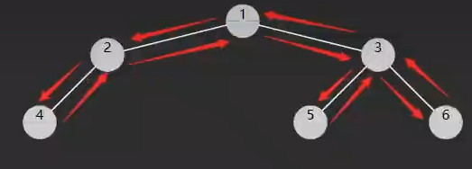

# Q
    midOrder(node.right);  // 右子树
    为什么这个返回在上一层？能回到上一节点
    
# A
递归调用栈的工作原理
当执行 midOrder(node.right) 时，并不是"返回到上一层"，而是当前函数调用完成，从调用栈中弹出，然后回到被中断的地方继续执行。

具体示例：
假设我们有这样的树：

    text
    2
    / \
    1   3
执行过程分解：
步骤1： midOrder(2) 开始执行

    java
    midOrder(2) {
    midOrder(1);  // ← 暂停当前函数，先处理左子树
    // 这里会暂停，等待 midOrder(1) 完成
    System.out.print(2);
    midOrder(3);
    }
步骤2： 进入 midOrder(1)

    java
    midOrder(1) {
    midOrder(null);  // 左子树为空，立即返回
    System.out.print(1);  // 输出: 1
    midOrder(null);  // 右子树为空，立即返回
    }  // ← midOrder(1) 执行完毕！
    关键时刻： 当 midOrder(1) 执行完毕后：

    text
    调用栈状态：
    之前： [midOrder(2) - 在第2行暂停]
    现在： [midOrder(2) - 恢复执行]
步骤3： midOrder(2) 恢复执行

    java
    // 从刚才暂停的地方继续执行
    System.out.print(2);  // 输出: 2
    midOrder(3);  // ← 再次暂停，处理右子树
为什么能"回到上一节点"？
这是因为调用栈（Call Stack） 的存在：

函数调用时：将当前执行状态压入栈

函数返回时：从栈顶弹出，恢复之前的执行状态

    text
    调用栈示例：
    []
    ↓ 调用 midOrder(2)
    [midOrder(2) - 执行到第2行]
    ↓ 调用 midOrder(1)  
    [midOrder(1), midOrder(2) - 在第2行暂停]
    ↓ midOrder(1) 完成
    [midOrder(2) - 恢复执行]
    ↓ 调用 midOrder(3)
    [midOrder(3), midOrder(2) - 在第4行暂停]
    ↓ midOrder(3) 完成
    [midOrder(2) - 恢复执行]
    ↓ midOrder(2) 完成
    []
更直观的比喻：
把递归想象成读书时使用书签：

你正在读第50页（相当于 midOrder(2)）

发现需要参考前面的第30页（相当于 midOrder(1)）

你在第50页放个书签，去读第30页

读完第30页后，拿出书签，回到第50页继续读

这就是"回到上一层"的本质

代码执行位置记忆：
Java虚拟机自动记录了每个函数的执行位置：

    public static void midOrder(TreeNode node) {
    if (node == null) return;
    
        midOrder(node.left);     // ← 位置1：执行到这里会暂停
        System.out.print(node.val); // ← 位置2：左子树完成后回到这里
        midOrder(node.right);    // ← 位置3：输出完成后继续执行这里
    }
所以 midOrder(node.right) 执行完毕后，不是"返回到上一层"，而是当前函数自然结束，控制权交还给调用它的那个函数（也就是在调用栈中的上一个函数）。

这样设计保证了遍历的正确顺序：左子树 → 当前节点 → 右子树。

# 前序

